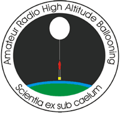

ARHAB is the study and use of high altitude balloons to explore near space using amateur radio. Near space is the region of atmosphere between 60,000 feet and the accepted boundary of space at 328,000 feet altitude. These altitudes make near space far more like Earth orbit than the surface of the Earth. Air pressure in near space reaches 99+% of a vacuum and temperatures drop to a low of -60F or colder. Cosmic radiation is over 100 times greater than at sea level. Hobbiests and citizen scientists alike use balloons to send payloads to near space, recording images and scientific data as they go.

For more information on ARHAB, [this Wikipedia entry](https://en.wikipedia.org/wiki/High-altitude_balloon#Amateur_High_Altitude_Ballooning) is a great introduction. Or read the [UKHAS Beginners Guide to High Altitude Ballooning](https://ukhas.org.uk/general:beginners_guide_to_high_altitude_ballooning) to start planning your own flight.
The APRS.org Wiki hosts a [page dedicated to ARHAB](http://info.aprs.net/index.php?title=ARHAB) with some additional information.

## ARHAB Community
The ARHAB community is active across the world:

- [GPSL Mailing List](https://groups.io/g/GPSL)
- [Balloon Sked Mailing List](http://groups.yahoo.com/group/balloon_sked/)
- [Balloonatics Mailing List](https://groups.yahoo.com/neo/groups/Balloonatics/info)

In the US, the annual [Great Plains Super Launch](http://www.superlaunch.org/) is the largest gathering of ARHAB enthusiasts.

## Tracking and Prediction Sites
Below are some recommended tracking sites:

- [UKHAS Tracker](https://tracker.habhub.org/)
- [APRS.fi](https://aprs.fi/)
- [UKHAS Landing Prediction](http://predict.habhub.org/)

## Old Site Archive

The old site was previously maintained by Keith Kaiser WA0TJT SK. It included a wealth of ARHAB information as well as an announcement form for groups to post their balloon launches.

Previously submitted flight missions are archived here: [View flight archive](flights-archive.html)

The full site is available for browsing on the Wayback Machine:
[ARHAB.org (2018)](https://web.archive.org/web/20171202230935/http://arhab.org/)

## Admin
The ARHAB.org site is currently maintained by Astra West W5MAW. My contact info is at [astra.lol](https://astra.lol).
